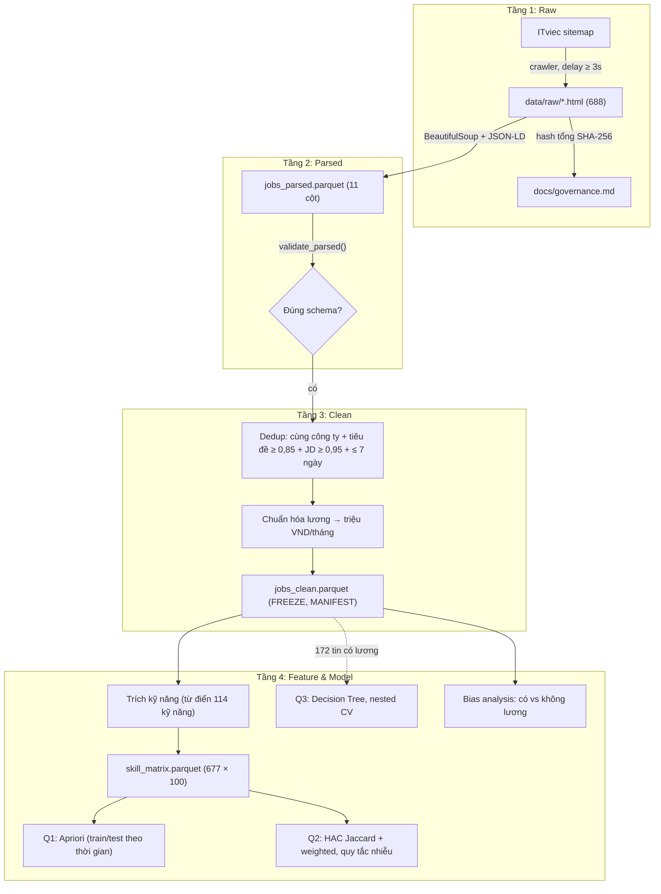

# 📊 Labor Market Intelligence — Thị Trường Tuyển Dụng CNTT & Dữ Liệu Việt Nam 2026

> **Đề tài:** Thị trường tuyển dụng ngành IT/Dữ liệu Việt Nam 2026 cần kỹ năng gì, và cấp bậc/kỹ năng nào đi kèm dải lương cao?
> **Môn học:** Fundamentals of Data Science (USTH) · Nhóm 5 người · 29/09 → 06/10/2026
> **Repository:** [github.com/dogtoro/Labor-Market-Intelligence](https://github.com/dogtoro/Labor-Market-Intelligence)

> [!NOTE]
> **Trạng thái (04/10/2026):** pipeline dữ liệu, 3 mô hình, phân tích thiên lệch, notebook và demo **đã hoàn thành** trên `main`. **Còn lại: slide trình bày** và 2 mục quản trị dữ liệu (xem [mục 2](#2-trạng-thái-dự-án)). Mọi con số trong README lấy từ `reports/` và `reports/key_numbers.json` (sinh bằng code).

> ⚠️ **Nguồn dữ liệu:** dự kiến ban đầu là TopCV, nhưng TopCV **chặn toàn bộ domain bằng Cloudflare JS Challenge** (kể cả `sitemap.xml`) với client không chạy JavaScript — không có cách vượt qua hợp lệ trong phạm vi quy tắc crawl của dự án (`CLAUDE.md` mục 3). Nhóm chuyển sang **ITviec** (robots.txt `Allow: /`, HTML render phía server). Chi tiết: [`docs/tos_review.md`](docs/tos_review.md), [`docs/DECISIONS.md`](docs/DECISIONS.md).

---

## 📑 Mục lục

1. [Kết quả chính](#1-kết-quả-chính)
2. [Trạng thái dự án](#2-trạng-thái-dự-án)
3. [Bài toán](#3-bài-toán)
4. [Phương pháp](#4-phương-pháp)
5. [Hạn chế](#5-hạn-chế)
6. [Chất lượng & quản trị dữ liệu](#6-chất-lượng--quản-trị-dữ-liệu)
7. [Cấu trúc thư mục](#7-cấu-trúc-thư-mục)
8. [Cài đặt & chạy](#8-cài-đặt--chạy)

---

## 1. Kết quả chính

### Dữ liệu

| Chỉ số | Giá trị |
|---|---|
| Tin tuyển dụng (ITviec, crawl 29/09/2026) | **688** (parse thành công 688/688, 0 tin trùng) |
| Khoảng ngày đăng | 10/08 → 29/09/2026 |
| Tin có công bố lương | **172 / 688 (25,0%)** — 151 ghi USD, 21 ghi VND; trung vị ≈ 38,7 triệu VND/tháng |
| Ma trận kỹ năng | **677 tin × 100 kỹ năng** (từ điển 114 kỹ năng; 11 tin không bắt được kỹ năng nào) |
| Kỹ năng phổ biến nhất | english 54,7%, api 45,2%, communication 42,0%, cicd 31,4%, git 28,6%, sql 28,5%, aws 27,6% |

### Q1 — Kỹ năng nào thường đi cùng nhau? (Apriori)

- Train 473 tin cũ / Test 204 tin mới (chia theo `posted_date`); `min_support = 0,1`, lift > 1,2, confidence ≥ 0,5 → **43 luật**.
- **9/10 luật top vẫn đạt** cả lift > 1,2 và confidence ≥ 0,5 trên tập test.

| Luật | Train conf / lift | Test conf / lift |
|---|---|---|
| spring → java | 1,00 / 4,68 | 1,00 / 4,00 |
| kubernetes → docker | 0,66 / 3,20 | 0,72 / 2,42 |
| gcp → aws | 0,81 / 3,00 | 0,94 / 3,09 |
| azure → aws | 0,74 / 2,75 | 0,78 / 2,56 |
| microservices → kubernetes | 0,59 / 2,88 | 0,40 / 1,74 *(không giữ được trên test)* |

Chi tiết + bảng luật có kỹ năng data: [`reports/rules_eval.md`](reports/rules_eval.md).

### Q2 — Tin tuyển dụng tự chia thành bao nhiêu nhóm nghề? (Hierarchical Clustering)

- 540 tin được phân cụm → **5 cụm thật + 21 tin nhiễu (3,9%)**:

| Cụm | Số tin | Đặc trưng (top kỹ năng) |
|---|---|---|
| 1 | 309 | DevOps/Backend chung — cicd, git, aws, docker, java |
| 2 | 85 | AI/Python — python, llm, cpp |
| 3 | 73 | SQL/.NET — sql (95%), mssql, dotnet |
| 4 | 26 | Cloud/Data — aws, azure, etl, airflow |
| 5 | 26 | QA — test_automation (100%), cicd |

- Purity **0,322** so với baseline 0,214 (gom tất cả vào 1 cụm); F-measure 0,343; **silhouette chỉ 0,066**.
- **Kết luận:** tổ hợp kỹ năng trên ITviec **không tách thành các nhóm nghề rõ ràng**; một cụm "chung" chiếm 60% số tin. Một vài cụm nhỏ (AI, SQL, QA) có đặc trưng rõ. Chi tiết: [`reports/purity_report.md`](reports/purity_report.md).

### Q3 — Cấp bậc/kỹ năng nào dự báo lương cao? (Decision Tree)

- 172 tin có lương, nhãn tertile: **Low < 32,2 ≤ Mid < 50,0 ≤ High** (triệu VND/tháng; 60/55/57 tin).
- Nested CV: accuracy out-of-fold **51,7%** (95% CI 44,2–59,3%) so với baseline **34,9%**; macro-F1 0,52.
- **Cấp bậc là yếu tố quan trọng nhất:** Lead (75% High), Manager (78% High), Senior (chia đều Mid/High), Middle (73% Low). Nhóm `Intern/Junior` toàn bộ là Low — nhưng 14/17 tin là **thực tập sinh** (phụ cấp, không phải lương).
- Các nhánh theo kỹ năng (docker, go, react, kubernetes…) dựa trên rất ít tin → không diễn giải thành "kỹ năng X → lương Y". Chi tiết: [`reports/classification_report.md`](reports/classification_report.md).

### Thiên lệch tin có / không công bố lương

| Chiều | Kết quả |
|---|---|
| **Địa điểm** | **Có thiên lệch có ý nghĩa:** HN 51,7% vs 38,6% (adj p = 0,006); HCM 47,7% vs 66,5% (adj p = 0,0001) |
| Kỹ năng (100 kỹ năng, Fisher + Benjamini–Hochberg) | Không kỹ năng nào khác biệt có ý nghĩa |
| Cấp bậc | Không khác biệt có ý nghĩa (chi-square p = 0,06) |

→ Mô hình lương ở Q3 **đại diện cho tin có công bố lương, nghiêng về Hà Nội**, không phải toàn bộ thị trường. Chi tiết: [`reports/bias_analysis.md`](reports/bias_analysis.md).

### So sánh với các phương pháp khác

Cùng dữ liệu, cùng cách chia fold và cùng thước đo với model của dự án; model của dự án được chạy lại trong module so sánh và kiểm khớp kết quả gốc. Chi tiết: [`reports/model_comparison.md`](reports/model_comparison.md), hình `reports/figures/model_compare_*.png`.

| Q3 — phân lớp dải lương (nested CV) | Accuracy (95% CI) | Macro-F1 |
|---|---|---|
| Lớp đông nhất (baseline) | 0,349 (0,285–0,419) | 0,172 |
| Cây quyết định chỉ dùng cấp bậc (6 đặc trưng) | 0,547 (0,471–0,616) | 0,541 |
| **Decision Tree — model dự án** (81 đặc trưng) | **0,517** (0,442–0,593) | 0,520 |
| Logistic regression (L2) | 0,570 (0,500–0,640) | 0,569 |
| Bernoulli naive Bayes | 0,547 (0,477–0,622) | 0,533 |
| k-NN (Jaccard) | 0,442 (0,372–0,512) | 0,433 |
| Random forest | **0,581** (0,506–0,651) | 0,578 |
| Gradient boosting (HistGB) | 0,465 (0,395–0,535) | 0,463 |

- Random forest cao nhất nhưng **không model nào tốt hơn cây quyết định có ý nghĩa thống kê** (CI bootstrap ghép cặp của hiệu accuracy đều chứa 0); chỉ baseline kém hơn có ý nghĩa.
- Cây chỉ dùng cấp bậc ≈ cây đầy đủ → với 172 tin, đặc trưng kỹ năng gần như không thêm thông tin cho một cây đơn.

| Q2 — phân cụm (540 tin, cùng quy tắc nhiễu) | Cụm thật | Nhiễu | Silhouette | Purity | ARI vs nhóm nghề |
|---|---|---|---|---|---|
| **HAC weighted — model dự án** | 5 | 3,9% | 0,066 | 0,322 | 0,079 |
| HAC average | 3 | 3,5% | 0,067 | 0,244 | 0,024 |
| HAC complete | 1 (không tách được) | — | — | — | — |
| K-means (vector nhị phân) | 7 | 0% | 0,059 | **0,374** | **0,107** |
| HDBSCAN (Jaccard) | 4 | 23,7% (vượt ngưỡng 5%) | 0,036 | 0,228 | 0,026 |

- Không phương pháp nào tìm được cấu trúc rõ (silhouette đều gần 0).
- **Bootstrap ghép cặp HAC weighted − K-means** (giữ nguyên 2 cách phân cụm, lấy mẫu lại tin 1.000 lần): purity −0,052 (95% CI −0,108 – −0,019) → **K-means cao hơn có ý nghĩa**; ARI −0,028 (CI −0,072 – +0,002) → **không khác biệt có ý nghĩa**. Purity tự tăng khi nhiều cụm hơn (K-means 7 cụm, HAC 5), nên đã so thêm **ở cùng số cụm thật (3–7)**: K-means vẫn có purity cao hơn có ý nghĩa ở 4/5 mức (ở 5 cụm: 0,415 so với 0,322), HAC không thắng ở mức nào; ARI phần lớn không khác biệt có ý nghĩa nhưng nghiêng về K-means.
- **Độ ổn định** (ARI giữa phân cụm trên toàn bộ dữ liệu và cùng 50 mẫu con 80%): HAC weighted **0,345**, HAC average 0,454, **K-means 0,630** → K-means ổn định hơn rõ rệt.

**Q1 — Apriori vs FP-Growth:** cho **cùng tập itemset và luật** ở mọi `min_support`; trên dữ liệu nhỏ này FP-Growth **chậm hơn** 2,4–3,4 lần (chi phí dựng cây FP lấn át; FP-Growth có lợi trên dữ liệu lớn hơn).

**Phương pháp dựa trên mô hình ngôn ngữ** (trích kỹ năng/dự đoán lương từ văn bản JD bằng transformer) chỉ nêu ở phần related work: 172 tin có nhãn là quá ít để huấn luyện, và khó giải thích.

---

## 2. Trạng thái dự án

### ✅ Đã hoàn thành

| Hạng mục | Kết quả | Người phụ trách |
|---|---|---|
| ToS / robots.txt, crawl | TopCV No-Go, ITviec Go; 688 tin, 715 request, 100% HTTP 200, delay ≥ 3s | Người 1 |
| Governance | `docs/governance.md`: UA, rate limit, ToS, backup, hash tổng 688 file HTML thô | Người 1 |
| Parse, dedup, chuẩn hóa lương | 688/688 tin, 0 trùng, tỷ giá 25.780 VND/USD; freeze `jobs_clean.parquet` (Mốc 2) | Người 2 |
| Từ điển kỹ năng + ma trận | 114 kỹ năng, alias phân biệt hoa thường, alias số nhiều; kiểm chứng độ phủ (A7) | Người 3 |
| Apriori + đánh giá train/test | `reports/rules_eval.md` | Người 3 |
| Clustering + purity | `reports/purity_report.md`, `data/processed/cluster_labels.csv` | Người 4 |
| Decision Tree + bias analysis | `reports/classification_report.md`, `reports/bias_analysis.md`, `models/tree_model.pkl` | Người 4 |
| EDA, notebook tổng hợp, demo | `notebooks/eda_full.ipynb`, `final_notebook.ipynb`, `demo.ipynb` (ipywidgets) — chạy Restart & Run All không lỗi; `reports/key_numbers.json` | Người 5 |
| So sánh với phương pháp khác | `src/models/comparison.py` → `reports/model_comparison.md` (Q1–Q3, yêu cầu giảng viên); mục 7 trong `final_notebook.ipynb` | Trưởng nhóm (Người 4 đã review) |
| Chất lượng code | 127 test pass; kết quả tái lập được (giống hệt giữa các `PYTHONHASHSEED`); SHA-256 trong `docs/MANIFEST.json` | Cả nhóm |

### ⏳ Chưa làm / còn mở

| Việc | Ghi chú |
|---|---|
| **Slide trình bày** (≤ 15 trang) | Chưa có trong repo. Số liệu và hình đã sẵn: `reports/key_numbers.json`, `reports/figures/` |
| Xác nhận quyền truy cập Drive + kiểm hash sau backup | 2 mục ⏳ trong `docs/governance.md` mục 5 |
| Upload bản cuối lên Drive | `skill_matrix.parquet` (`26f6716e…`), `cluster_labels.csv` (`044fe534…`) |
| Đạt ngưỡng độ phủ từ điển ≥ 80% (A7) | **Chưa đạt:** 72,6% trên bộ kiểm tra độc lập — ghi vào hạn chế, không chỉnh thêm để tránh overfit |
| Ghi `docs/STANDUP.md` | Vẫn là template |

Lịch: Mốc 3 (khoá nội dung) **đã lùi** để bổ sung phần so sánh theo yêu cầu giảng viên (DECISIONS 04/10); khoá code ngay sau khi xong, trước buổi tổng duyệt. Ngày thuyết trình: xác nhận lại với giảng viên.

---

## 3. Bài toán

### 3.1 Bối cảnh

Thị trường IT/Dữ liệu Việt Nam đòi hỏi kỹ sư kết hợp nhiều nhóm kỹ năng (cloud, DevOps, data, AI) thay vì một ngôn ngữ đơn lẻ. Người học gặp 3 khoảng trống thông tin: không rõ **kỹ năng nào đi cùng nhau**, **tiêu đề tin tuyển dụng không phản ánh nhóm nghề thật**, và **phần lớn tin giấu lương** ("Thỏa thuận").

### 3.2 Câu hỏi nghiên cứu

| Mã | Câu hỏi | Phương pháp |
|---|---|---|
| **Q1** | Nhóm kỹ năng nào thường **đồng xuất hiện** trong JD? Luật nào có confidence và lift cao, và có giữ được trên tin mới hơn không? | Association Rules (Apriori), chia train/test theo thời gian |
| **Q2** | Tin tuyển dụng tự nhiên chia thành **bao nhiêu nhóm nghề** theo tổ hợp kỹ năng? Có khớp danh mục "Job Expertise" của ITviec không? | Hierarchical Clustering (Jaccard + weighted linkage), purity, F-measure |
| **Q3** | **Cấp bậc, kỹ năng, địa điểm** nào phân định dải lương? Tin có lương có thiên lệch so với tin giấu lương không? | Decision Tree (CART), nested CV, feature importance; bias analysis |

### 3.3 Phạm vi & nguyên tắc

- **Nguồn:** tin tuyển dụng công khai trên ITviec, crawl **1 đợt** (snapshot 29/09/2026) từ sitemap `twinnings_jobs_desc_en.xml`.
- **Crawl có trách nhiệm:** User-Agent trung thực kèm email nhóm, delay ≥ 3s, tôn trọng robots.txt, không đăng nhập, không gọi API nội bộ.
- **Cam kết sử dụng dữ liệu:** chỉ công bố số liệu tổng hợp, **không trích nguyên văn JD**, không commit/chia sẻ HTML thô; lương lấy từ JSON-LD `baseSalary` mà ITviec nhúng công khai (giao diện ẩn lương sau đăng nhập).
- **Tái lập:** mọi con số sinh từ code; dữ liệu đã freeze được kiểm SHA-256.

---

## 4. Phương pháp

### 4.1 Pipeline 4 tầng



#### Chi tiết vận hành luồng dữ liệu qua 4 tầng

| Tầng | Đầu vào → đầu ra | Bước pipeline | Chốt chặn |
|---|---|---|---|
| 1. Raw | Sitemap ITviec → `data/raw/{job_id}.html` + `data/crawl_log.csv` | `crawl` (`src/crawl/crawler.py`) | robots.txt, delay ≥ 3s, hash tổng HTML |
| 2. Parsed | HTML → `data/interim/jobs_parsed.parquet` + `reports/parse_errors.csv` | `parse` (`src/parse/parser.py`) | `validate_parsed()`, tỷ lệ parse ≥ 90% |
| 3. Clean | `jobs_parsed` → `data/processed/jobs_clean.parquet` + `reports/dedup_report.md` | `clean` (`src/clean/dedup.py`) | `validate_clean()`, freeze + SHA-256 (Mốc 2) |
| 4. Feature & Model | `jobs_clean` → `skill_matrix.parquet` → luật, cụm, cây, bias → `reports/`, `models/` | `skills`, `rules`, `cluster`, `classify`, `bias`, `figures` | `validate_skills()`, kiểm hash với MANIFEST |

1. **Tầng 1 — Thu thập dữ liệu thô (Raw Ingestion)**
   - **Nguồn:** crawler đọc `robots.txt` (dừng nếu không đọc được), lấy danh sách URL từ sitemap `twinnings_jobs_desc_en.xml` (bản `_vn.xml` trùng 100% slug nên không dùng), rồi tải từng trang tin công khai. `job_id` = toàn bộ slug URL.
   - **Kiểm soát tốc độ:** mỗi request cách request trước ≥ 3,1 giây; mỗi URL được kiểm `robots.txt` trước khi gửi; User-Agent `USTH-FDS-Project/2026 (contact: …)` lấy email từ biến `CRAWL_CONTACT` (thiếu thì crawler từ chối chạy).
   - **Cache & log:** file đã có trong `data/raw/` thì không tải lại; mọi request thật được ghi vào `data/crawl_log.csv` (`url`, `status`, `timestamp`). Lần crawl 29/09: 715 request ITviec, 100% HTTP 200.
   - **Toàn vẹn:** HTML thô không commit (chỉ lưu local + Google Drive); hash tổng 688 file ghi trong `docs/governance.md`.

2. **Tầng 2 — Phân tích cú pháp & kiểm định cấu trúc (Parsing & Validation)**
   - **Bóc tách:** BeautifulSoup đọc khối JSON-LD `JobPosting` (title, công ty, `datePosted`, `baseSalary`, `addressRegion`), dòng "Job Expertise" (`category`) và 2 mục JD; `url`, `crawled_at` ghép từ `crawl_log.csv`; `level` suy từ tiêu đề.
   - **Lỗi từng file không dừng cả batch:** file lỗi được ghi vào `reports/parse_errors.csv`; pipeline **dừng** nếu tỷ lệ parse < 90%. Thực tế: 688/688, 0 lỗi.
   - **Chốt chặn 1 — `validate_parsed()`:** đủ cột bắt buộc, không null ở `job_id`/`url`/`title`/`company`/`jd_text`/`crawled_at`, `job_id` duy nhất. Vi phạm → `ValueError`, không ghi file.

3. **Tầng 3 — Làm sạch & chuẩn hóa (Cleaning & Normalization)**
   - **Dedup:** so từng cặp tin **trong cùng công ty** theo tiêu đề, JD và ngày đăng; bản trùng bị loại hẳn, bản còn lại có `is_duplicate = False`. Báo cáo + hình phễu `reports/figures/data_funnel.png`.
   - **Chuẩn hóa lương:** `salary_raw` → `salary_min`, `salary_max` (triệu VND/tháng), `salary_status`, `currency_original`.
   - **Chốt chặn 2 — `validate_clean()`:** `salary_status` thuộc enum; `full_range` có đủ 2 cận và `min ≤ max`; `one_sided` có đúng 1 cận; `undisclosed` không có cận.
   - **Freeze (Mốc 2, 01/10):** `jobs_clean.parquet` (688 dòng) được ghi SHA-256 vào `docs/MANIFEST.json`; từ đây **không đổi schema**, mọi bước sau đọc đúng file này.

4. **Tầng 4 — Trích đặc trưng & mô hình (Feature Engineering & Modeling)**
   - **Ma trận kỹ năng:** `skills` quét `jd_text` bằng từ điển → ma trận nhị phân 0/1 (`int8`), bỏ kỹ năng < 5 tin và tin không có kỹ năng nào → `skill_matrix.parquet` (677 × 100). **Chốt chặn 3 — `validate_skills()`**: `job_id` duy nhất, chỉ chứa 0/1. Sau bước này phải chạy `make_manifest.py` để ghi hash mới.
   - **Kiểm hash trước khi chạy model:** `cluster`, `classify`, `bias` đều đọc dữ liệu qua `load_and_verify_data()` — so SHA-256 của `jobs_clean` và `skill_matrix` với MANIFEST, **lệch thì dừng** (tránh dùng nhầm bản cũ).
   - **Phân luồng cho 3 câu hỏi:**
     - **Q1 (Apriori) và Q2 (clustering)** dùng **toàn bộ tin có kỹ năng** — có lương hay không đều mang thông tin về tổ hợp kỹ năng. Đầu ra: `data/processed/rules_train.csv`, `reports/rules_eval.md`; `data/processed/cluster_labels.csv` (cụm 1–5, nhiễu = −1), `reports/purity_report.md`, `dendrogram.png`.
     - **Q3 (Decision Tree)** chỉ dùng **172 tin có lương** (học có giám sát cần nhãn lương), left join với ma trận kỹ năng để giữ đủ 172 tin. Đầu ra: `reports/classification_report.md`, `tree_cv_results.csv`, `tree_viz.png`, `confusion_matrix.png`, `models/tree_model.pkl`.
     - **Bias analysis** so 172 tin có lương với **516 tin không lương** để xác định phạm vi áp dụng của Q3. Đầu ra: `reports/bias_analysis.md`, `bias_*.png`.
   - **Trình bày:** `figures` xuất hình EDA (`eda_*.png`); `notebooks/final_notebook.ipynb` gọi lại đúng các hàm trong `src/models/`, đối chiếu số với report và xuất `reports/key_numbers.json` cho slide.

Lệnh tương ứng: `scripts/run_pipeline.py` với các bước `crawl → parse → clean → skills → rules → cluster → classify → bias → figures → manifest`.

### 4.2 Tiền xử lý

- **Parse** (`src/parse/parser.py`): 11 cột `job_id, url, title, company, level, location, posted_date, category, salary_raw, jd_text, crawled_at`. `title`, `company`, `datePosted`, `baseSalary`, `addressRegion` lấy từ JSON-LD `JobPosting`; `category` = trường "Job Expertise"; `jd_text` chỉ gồm 2 mục "Job description" và "Your skills and experience". `job_id` = toàn bộ slug URL (4 số cuối không unique). `level` suy từ tiêu đề (ITviec không có trường cấp bậc) — suy được 57,6% số tin.
- **Dedup** (`src/clean/dedup.py`): cùng công ty **và** tiêu đề giống ≥ 0,85 **và** JD giống ≥ 0,95 **và** ngày đăng cách ≤ 7 ngày (`difflib.SequenceMatcher`); giữ bản mới hơn. Điều kiện JD được thêm vì tiêu đề ITviec theo khuôn mẫu. Kết quả: 0 tin trùng.
- **Lương** (`src/parse/salary.py`): quy đổi USD × 25.780 / 10⁶ (tỷ giá Vietcombank 29/09, A9); lương ngày × 20 (A18); không điều chỉnh gross/net (A14). Trạng thái `full_range` / `one_sided` / `undisclosed`. `salary_mid` = trung bình 2 cận (`full_range`) hoặc cận duy nhất (`one_sided`).
- **Nhãn lương:** ngưỡng cố định 15/30 triệu chỉ cho 18/29/125 tin (lương ITviec cao) → **chia tertile** trên 172 tin có lương (Mốc 2, 01/10).
- **Trích kỹ năng** (`src/skills/extractor.py`): từ điển `skill_dict.json` (114 kỹ năng, mỗi kỹ năng có alias). Khớp không phân biệt hoa thường với ranh giới `(?<![\w+#.])…(?![\w+#])` (giữ được `C++`, `C#`, `.NET`); các alias trùng từ tiếng Anh thông thường (`React`, `Spring`, `Excel`, `Go`, `Swift`) khớp **phân biệt hoa thường** (`Go` không khớp "Go-live"). Có alias dạng số nhiều (vd. "APIs"). Chỉ giữ kỹ năng xuất hiện ≥ 5 tin.

### 4.3 Q1 — Apriori

- Support, confidence, lift theo định nghĩa chuẩn; luật A→B và B→A cùng lift nên mỗi tập kỹ năng chỉ giữ luật có confidence cao hơn.
- Sắp tin theo `posted_date` (sort ổn định, `job_id` làm khóa phụ): **70% cũ = train, 30% mới = test**.
- Grid `min_support ∈ {0,03; 0,04; 0,05; 0,06; 0,10}`, lift > 1,2, confidence ≥ 0,5; chọn mức cho 20–100 luật. Thêm bảng riêng "luật có ít nhất 1 kỹ năng data" với `min_support` chọn theo số luật data.
- Đánh giá: tỷ lệ luật vẫn đạt cả lift và confidence trên test.

### 4.4 Q2 — Hierarchical Clustering

- Khoảng cách **Jaccard** trên vector kỹ năng nhị phân.
- Trước khi phân cụm: bỏ kỹ năng mềm/công cụ quản lý, kỹ năng xuất hiện > 40% hoặc < 10 tin, và tin còn < 2 kỹ năng.
- **Weighted linkage (WPGMA):** Ward không hợp lệ với Jaccard; average bị chaining (1 cụm 95% tin); complete không cắt được (42% cặp tin có khoảng cách = 1).
- **Chọn k:** k ∈ 4–8; cụm < 15 tin coi là **nhiễu** (nhãn −1); k hợp lệ khi có ≥ 3 cụm thật và nhiễu ≤ 5%; chọn silhouette cao nhất.
- **Purity** và F-measure so với "Job Expertise" gộp 72 giá trị → 10 nhóm (`src/models/expertise_groups.json`, A16 đã review).

### 4.5 Q3 — Decision Tree

- Feature: kỹ năng (≥ 5 lần trong 172 tin), cấp bậc one-hot (`Intern/Junior`, `Middle`, `Senior`, `Lead`, `Manager`, `Unknown`), địa điểm multi-hot (HCM/HN/ĐN/khác). Không có số năm kinh nghiệm.
- **Nested CV:** vòng ngoài 5 fold (đánh giá), vòng trong 3 fold chọn `max_depth ∈ {3,4,5,6}`, `min_samples_leaf ∈ {5,10,15}`. Accuracy, confusion matrix và bootstrap CI (1.000 lần) tính trên dự đoán out-of-fold; so với baseline (đoán lớp đông nhất).
- Mô hình cuối: bộ tham số được chọn nhiều nhất (hoà → cây nông hơn), lưu `models/tree_model.pkl` + metadata.

### 4.6 Bias analysis

So sánh 172 tin có lương với 516 tin không lương: kỹ năng (Fisher exact + Benjamini–Hochberg), địa điểm (Fisher + BH), cấp bậc (chi-square). Tiền tệ chỉ mô tả nhóm có lương (tin không lương không có thông tin tiền tệ).

### 4.7 So sánh với phương pháp khác

`src/models/comparison.py` (`python scripts/run_pipeline.py compare`): mọi phương pháp chạy trên cùng dữ liệu, cùng fold và cùng thước đo với model dự án.
- **Q3:** Decision Tree so với baseline lớp đông nhất, cây chỉ dùng cấp bậc, logistic regression, Bernoulli naive Bayes, k-NN (Jaccard), random forest, gradient boosting — cùng nested CV (5×3, cùng seed); CI bootstrap của accuracy và CI bootstrap ghép cặp của hiệu accuracy so với cây.
- **Q2:** HAC weighted so với HAC average/complete, K-means, HDBSCAN — cùng ma trận kỹ năng đã lọc và cùng quy tắc nhiễu; thêm kiểm tra độ ổn định bằng 50 mẫu con 80% (ARI).
- **Q1:** Apriori so với FP-Growth — kiểm tra trùng tập luật và so thời gian chạy.

---

## 5. Hạn chế

- **Dữ liệu:** 688 tin (dưới ngưỡng 1.000 đặt ra ban đầu), 1 nguồn, 1 snapshot. Chia train/test theo ngày đăng trên snapshot đo **tuổi của tin** (tin cũ còn active vs tin mới), không đo thay đổi thị trường dài hạn.
- **Lương:** chỉ 25% tin công bố lương, nghiêng về Hà Nội; 88% ghi USD (phụ thuộc tỷ giá cố định); không phân biệt gross/net; **phụ cấp thực tập** nằm lẫn trong dữ liệu lương.
- **Từ điển kỹ năng:** độ phủ **72,6%** trên bộ 20 JD kiểm tra độc lập (dưới ngưỡng 80% dự kiến); phần sót là công cụ ngách và kỹ năng mềm diễn đạt tự do.
- **Cấp bậc:** suy từ tiêu đề, 42% tin không suy được (`Unknown`).
- **Phân cụm:** silhouette ~0,07 và **nhạy với từ điển** (thêm alias số nhiều buộc phải đổi quy tắc chọn k — `docs/DECISIONS.md` 04/10).
- **Decision Tree:** 172 mẫu nên CI rộng; nhiều lá < 10 tin; không tốt hơn có ý nghĩa so với các classifier khác, và cây chỉ dùng cấp bậc cho kết quả tương đương (`reports/model_comparison.md`).
- **Độ ổn định phân cụm:** HAC weighted (model dự án) chỉ 0,345 ARI giữa các mẫu con 80%, kém K-means (0,630); K-means cũng có purity cao hơn có ý nghĩa — các cụm cụ thể của HAC không nên coi là kết luận chắc chắn.

---

## 6. Chất lượng & quản trị dữ liệu

| Cơ chế | Chi tiết |
|---|---|
| Data contract | `src/contract.py`: `validate_parsed`, `validate_clean`, `validate_skills` — dừng ngay nếu sai schema (`docs/DATA_CONTRACT.md`) |
| Freeze + SHA-256 | `docs/MANIFEST.json` cho file processed; code model **tự kiểm hash** và dừng nếu lệch (`src/models/features.py`). Hash tổng 688 file HTML thô trong `docs/governance.md` |
| Tái lập | Thứ tự luật, chia train/test, `random_state` cố định; kết quả giống hệt giữa các `PYTHONHASHSEED` |
| Test | 121 test (`tests/`): contract, parser, dedup, lương, kỹ năng, Apriori, clustering, Decision Tree, bias, A7, viz |
| Quyết định & giả định | `docs/DECISIONS.md`, `docs/ASSUMPTIONS.md` (A1–A18) |
| Governance | `docs/governance.md`: User-Agent, rate limit, ToS/robots.txt, backup, quyền truy cập, dữ liệu cá nhân |

---

## 7. Cấu trúc thư mục

```text
Labor-Market-Intelligence/
├── CLAUDE.md, README.md, Makefile, requirements.txt, pyproject.toml
├── data/                          # gitignore — dữ liệu trên Google Drive
│   ├── crawl_log.csv              # log request (đã commit, bằng chứng rate limit)
│   ├── raw/                       # 688 file HTML thô (không commit)
│   ├── interim/jobs_parsed.parquet
│   └── processed/                 # jobs_clean (freeze), skill_matrix, rules_train, cluster_labels
├── docs/
│   ├── DATA_CONTRACT.md, DECISIONS.md, ASSUMPTIONS.md, MANIFEST.json
│   ├── governance.md, tos_review.md, WORKFLOW.md, STANDUP.md
│   └── tasks/                     # brief từng vai
├── src/
│   ├── contract.py
│   ├── crawl/crawler.py
│   ├── parse/parser.py, salary.py
│   ├── clean/dedup.py
│   ├── skills/extractor.py, skill_dict.json, __main__.py
│   ├── models/apriori.py, features.py, clustering.py, classification.py, bias_analysis.py, expertise_groups.json
│   └── viz/eda.py, __main__.py
├── notebooks/                     # eda_draft, eda_full, final_notebook, demo
├── reports/
│   ├── rules_eval.md, purity_report.md, classification_report.md, bias_analysis.md
│   ├── dedup_report.md, A7_evaluation*.md, a7_manual_labels*.csv, tree_cv_results.csv
│   ├── key_numbers.json           # số liệu cho slide (sinh từ final_notebook)
│   └── figures/                   # 24 hình: eda_*, model_*, dendrogram, tree_viz, confusion_matrix, bias_*
├── models/tree_model.pkl, tree_model_meta.json
├── scripts/run_pipeline.py, make_manifest.py, verify_a7.py, generate_fixtures.py
└── tests/                         # pytest + fixtures
```

---

## 8. Cài đặt & chạy

### 8.1 Cài đặt

Yêu cầu **Python 3.11+**.

```bash
python -m venv .venv
source .venv/bin/activate          # Windows: .venv\Scripts\activate
pip install -r requirements.txt    # gồm cả Jupyter, ipywidgets cho notebook
```

### 8.2 Test

```bash
python -m pytest -q                # 121 passed
```

Một số test dùng dữ liệu thật sẽ tự `skip` nếu chưa có file trong `data/processed/`.

### 8.3 Chạy lại phần model (từ dữ liệu đã freeze)

Tải `jobs_clean.parquet` từ Drive nhóm vào `data/processed/` và kiểm hash với `docs/MANIFEST.json`, rồi:

```bash
python scripts/run_pipeline.py skills
python scripts/make_manifest.py              # bắt buộc ngay sau `skills` — các bước model kiểm hash
for s in rules cluster classify bias compare figures; do python scripts/run_pipeline.py $s || break; done
python scripts/make_manifest.py
```

Chạy lại từ đầu (`crawl` → `parse` → `clean`) cần 688 file HTML trong `data/raw/` (trên Drive) và biến môi trường `CRAWL_CONTACT=<email nhóm>`; **không cần crawl lại** vì dữ liệu đã freeze.

**Kiểm tra toàn vẹn** (không dùng `make_manifest.py` để kiểm tra, vì nó ghi đè MANIFEST):

```bash
sha256sum data/processed/*.parquet data/processed/*.csv   # so với docs/MANIFEST.json
```

### 8.4 Notebook

```bash
jupyter notebook notebooks/final_notebook.ipynb    # EDA + 3 mô hình + bias + so sánh phương pháp, xuất reports/key_numbers.json
jupyter notebook notebooks/demo.ipynb              # demo tương tác (ipywidgets)
```
