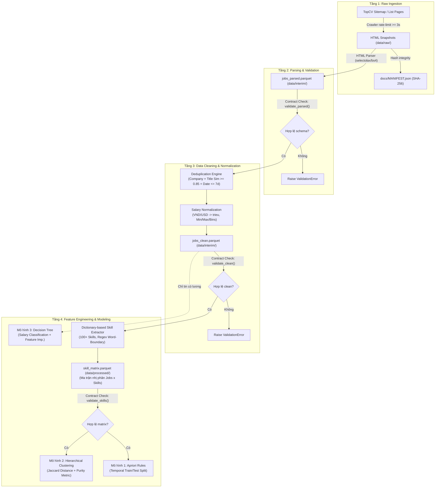

# 📊 Labor Market Intelligence — Thị Trường Tuyển Dụng CNTT & Dữ Liệu Việt Nam 2026

> **Đề tài:** Thị trường tuyển dụng ngành IT/Dữ liệu Việt Nam 2026 cần kỹ năng gì, và cấp bậc/kỹ năng nào đi kèm dải lương cao?  
> **Môn học:** Fundamentals of Data Science (USTH)  
> **Repository:** [https://github.com/dogtoro/Labor-Market-Intelligence](https://github.com/dogtoro/Labor-Market-Intelligence)

---

## 📑 Mục Lục
1. [Bối Cảnh & Mô Tả Bài Toán (Problem Statement)](#1-bối-cảnh--mô-tả-bài-toán-problem-statement)
   - [1.1 Bối cảnh thực tiễn](#11-bối-cảnh-thực-tiễn)
   - [1.2 Mục tiêu nghiên cứu](#12-mục-tiêu-nghiên-cứu)
   - [1.3 Câu hỏi nghiên cứu (Research Questions)](#13-câu-hỏi-nghiên-cứu-research-questions)
   - [1.4 Phạm vi dữ liệu & Nguyên tắc tiếp cận](#14-phạm-vi-dữ-liệu--nguyên-tắc-tiếp-cận)
2. [Phương Pháp Luận (Methodology)](#2-phương-pháp-luận-methodology)
   - [2.1 Kiến trúc tổng thể Pipeline (End-to-End Architecture)](#21-kiến-trúc-tổng-thể-pipeline-end-to-end-architecture)
   - [2.2 Tiền xử lý & Chuẩn hóa dữ liệu (Data Preprocessing)](#22-tiền-xử-lý--chuẩn-hóa-dữ-liệu-data-preprocessing)
     - [Trích xuất bảng & Lưu trữ](#trích-xuất-bảng--lưu-trữ)
     - [Khử trùng lặp đa tiêu chí (Deduplication)](#khử-trùng-lặp-đa-tiêu-chí-deduplication)
     - [Chuẩn hóa & Rời rạc hóa dải lương (Salary Normalization & Discretization)](#chuẩn-hóa--rời-rạc-hóa-dải-lương-salary-normalization--discretization)
     - [Trích xuất kỹ năng bằng từ điển Regex (Skill Extraction)](#trích-xuất-kỹ-năng-bằng-từ-điển-regex-skill-extraction)
   - [2.3 Khai phá tập mẫu phổ biến & Luật kết hợp (Association Rule Mining — Apriori)](#23-khai-phá-tập-mẫu-phổ-biến--luật-kết-hợp-association-rule-mining--apriori)
   - [2.4 Phân cụm vị trí việc làm (Hierarchical Agglomerative Clustering — HAC)](#24-phân-cụm-vị-trí-việc-làm-hierarchical-agglomerative-clustering--hac)
   - [2.5 Phân lớp dự đoán dải lương & Tầm quan trọng đặc trưng (Decision Tree Classification)](#25-phân-lớp-dự-đoán-dải-lương--tầm-quan-trọng-đặc-trưng-decision-tree-classification)
   - [2.6 Phân tích thiên lệch dữ liệu (Missing Data Bias Analysis)](#26-phân-tích-thiên-lệch-dữ-liệu-missing-data-bias-analysis)
3. [Đảm Bảo Chất Lượng & Quản Trị Dữ Liệu (Data Contract & Governance)](#3-đảm-bảo-chất-lượng--quản-trị-dữ-liệu-data-contract--governance)
4. [Cấu Trúc Thư Mục Dự Án](#4-cấu-trúc-thư-mục-dự-án)
5. [Hướng Dẫn Cài Đặt & Chạy Thử](#5-hướng-dẫn-cài-đặt--chạy-thử)

---

## 1. Bối Cảnh & Mô Tả Bài Toán (Problem Statement)

### 1.1 Bối cảnh thực tiễn
Thị trường lao động ngành Công nghệ Thông tin (IT) và Kỹ thuật/Khoa học Dữ liệu (Data Science, Data Engineering, AI/ML) tại Việt Nam năm 2026 đang chứng kiến sự dịch chuyển mạnh mẽ. Sự phát triển bùng nổ của Generative AI, điện toán đám mây và kiến trúc dữ liệu lớn (Lakehouse, MLOps) đặt ra yêu cầu mới đối với các kỹ sư: không còn đơn thuần là biết một ngôn ngữ lập trình độc lập, mà đòi hỏi sự kết hợp đồng thời của các nhóm kỹ năng (skill bundles).

Tuy nhiên, sinh viên mới ra trường và người tìm việc thường đối mặt với các bất cân xứng thông tin:
- **Khoảng cách kỹ năng (Skill Gap):** Không nắm rõ tổ hợp kỹ năng nào thường xuyên được các nhà tuyển dụng yêu cầu đi kèm với nhau.
- **Phân nhóm công việc thực tế vs Danh mục lý thuyết:** Các tiêu đề tuyển dụng trên mạng xã hội và sàn tuyển dụng có sự đa dạng rất lớn ("Python Dev", "Data Platform Engineer", "Backend AI Engineer"...), gây khó khăn cho việc phân định ranh giới nghề nghiệp.
- **Minh bạch thu nhập:** Phần lớn tin tuyển dụng ghi lương "Thoả thuận" hoặc "Cạnh tranh", gây nhiễu và thiên lệch khi người học muốn định giá kỹ năng của mình trên thị trường.

### 1.2 Mục tiêu nghiên cứu
Dự án **Labor Market Intelligence** thu thập, làm sạch và khai phá dữ liệu tuyển dụng IT/Dữ liệu quy mô thực tế từ nền tảng tuyển dụng TopCV nhằm mục đích:
1. Phát hiện các **quy luật kết hợp kỹ năng (Skill Association Rules)** được săn đón nhiều nhất.
2. Tự động **phân nhóm các vị trí tuyển dụng (Job Clustering)** theo không gian kỹ năng thực tế thay vì dựa vào nhãn cảm tính.
3. Đánh giá tác động của **kỹ năng, cấp bậc kinh nghiệm và địa điểm** tới khả năng đạt **dải lương cao** (thông qua mô hình học máy có khả năng giải thích).

### 1.3 Câu hỏi nghiên cứu (Research Questions)

| Mã | Câu hỏi nghiên cứu | Phương pháp / Mô hình giải quyết |
| :--- | :--- | :--- |
| **Q1** | Những nhóm kỹ năng nào thường xuyên **đồng xuất hiện (co-occur)** trong các bản mô tả công việc (JD)? Luật nào có độ tin cậy (*Confidence*) và độ nâng (*Lift*) cao nhất? | **Association Rules (Apriori Algorithm)** |
| **Q2** | Các tin tuyển dụng tự nhiên phân tách thành **bao nhiêu nhóm nghề** theo tổ hợp kỹ năng thực tế? Các cụm tìm được có khớp với danh mục tuyển dụng chuẩn không? | **Hierarchical Clustering (Jaccard Distance + Ward's/Average Linkage) & Cluster Purity** |
| **Q3** | Các kỹ năng nào đóng vai trò **tiên quyết để phân định dải thu nhập** (thấp vs trung bình vs cao)? Có tồn tại thiên lệch hệ thống giữa tin công khai lương và tin giấu lương không? | **Decision Tree Classification (CART), Feature Importance & Missing Data Bias Analysis** |

### 1.4 Phạm vi dữ liệu & Nguyên tắc tiếp cận
- **Nguồn dữ liệu:** Tin tuyển dụng công khai thuộc ngành IT/Software và Data/AI trên nền tảng TopCV.
- **Phương thức:** Thu thập 1 đợt (snapshot), có rate-limit chặt chẽ ($\ge 3$s/request), tuân thủ ToS và `robots.txt`.
- **Tính toán tái lặp (Reproducibility):** Toàn bộ dữ liệu thô và trung gian được bảo chứng tính toàn vẹn bằng mã băm SHA-256 (`docs/MANIFEST.json`).

---

## 2. Phương Pháp Luận (Methodology)

### 2.1 Kiến trúc tổng thể Pipeline (End-to-End Architecture)

Quy trình dữ liệu được thiết kế theo mô hình **4 tầng dữ liệu phân tách rõ ràng (Layered Data Architecture)**:



#### Chi tiết vận hành luồng dữ liệu qua 4 tầng:

1. **Tầng 1: Thu thập dữ liệu thô (Raw Ingestion Layer)**
   - **Nguồn thu thập:** Hệ thống crawler thu thập dữ liệu công khai từ Sitemap và danh mục việc làm ngành IT / Dữ liệu trên nền tảng TopCV.
   - **Kiểm soát tốc độ (Crawler Rate-limit $\ge 3$s):** Cơ chế tạm dừng (delay) tối thiểu 3 giây giữa mỗi request HTTP liên tiếp. Đây là quy tắc thu thập dữ liệu có trách nhiệm (Polite Web Scraping) nhằm tôn trọng tài nguyên máy chủ, tuân thủ `robots.txt` và tránh kích hoạt cơ chế chặn tự động (Cloudflare / WAF 429 Too Many Requests).
   - **Bảo chứng tính toàn vẹn (Reproducibility):** Toàn bộ file HTML thô được lưu trữ nguyên bản tại `data/raw/{job_id}.html`. Sau khi thu thập xong, mã băm SHA-256 của từng file được đóng băng trong `docs/MANIFEST.json` để đảm bảo dữ liệu nghiên cứu có thể kiểm chứng độc lập.

2. **Tầng 2: Phân tích cú pháp & Kiểm định cấu trúc (Parsing & Schema Validation Layer)**
   - **Bóc tách dữ liệu:** Bộ trích xuất HTML kết hợp `selectolax` (tốc độ cao) và `BeautifulSoup4` phân giải HTML thô thành bảng dữ liệu gồm 10 trường thông tin chuẩn: `job_id`, `title`, `company`, `location`, `salary_raw`, `experience_raw`, `job_description`, `posted_date`, `url`. Kết quả lưu dưới dạng `data/interim/jobs_parsed.parquet`.
   - **Chốt chặn hợp đồng 1 (`validate_parsed`):** Áp dụng nguyên lý *Fail-fast* (thất bại sớm) ngay tại cửa ngõ dữ liệu. Hàm kiểm định bắt buộc dữ liệu không rỗng, đủ 10 cột chuẩn, `job_id` là khóa chính duy nhất và không bị khuyết thiếu `title`, `company`. Nếu vi phạm, pipeline sẽ lập tức ngắt và báo lỗi (`Raise ValidationError`).

3. **Tầng 3: Làm sạch & Chuẩn hóa nghiệp vụ (Data Cleaning & Normalization Layer)**
   - **Khử trùng lặp đa tiêu chí (Deduplication Engine):** Tin tuyển dụng thực tế thường xuyên được các doanh nghiệp đăng lại nhiều lần trong tuần. Bộ lọc đối sánh bộ ba tiêu chuẩn: cùng công ty, độ tương đồng chuỗi tiêu đề $\ge 0.85$ (Gestalt Pattern Matching qua `difflib.SequenceMatcher`) và khoảng cách ngày đăng $\le 7$ ngày; tự động giữ lại bản ghi mới hơn và loại bỏ bản trùng lặp.
   - **Chuẩn hóa thu nhập (Salary Normalization):** Nhận diện cấu trúc lương chuỗi tiếng Việt/tiếng Anh, quy đổi ngoại tệ (USD sang VNĐ triệu), phân loại vào 3 trạng thái (`full_range`, `one_sided`, `undisclosed`) và tính lương trung vị đại diện `salary_mid = (min + max) / 2`.
   - **Chốt chặn hợp đồng 2 (`validate_clean`):** Kiểm tra tính hợp lệ nghiệp vụ trên `data/interim/jobs_clean.parquet` (tin có đủ dải lương bắt buộc thỏa mãn $0 < \text{salary}_{\min} \le \text{salary}_{\max}$; các tin giấu lương bắt buộc các cột số liệu là null).

4. **Tầng 4: Trích xuất đặc trưng & Khai phá mô hình (Feature Engineering & Modeling Layer)**
   - **Trích xuất ma trận kỹ năng (Skill Extraction):** Quét toàn bộ phần mô tả công việc (JD) qua từ điển chuẩn hóa $> 100$ kỹ năng IT/Data kết hợp ranh giới từ Regex `\b` (tránh nhầm lẫn các từ ngắn như "C", "R", "Go"). Tạo ra ma trận nhị phân $Jobs \times Skills$ tại `data/processed/skill_matrix.parquet`.
   - **Chốt chặn hợp đồng 3 (`validate_skills`):** Bảo đảm ma trận kỹ năng chỉ chứa giá trị nhị phân $\{0, 1\}$ và không bị lỗi kiểu dữ liệu.
   - **Phân luồng dữ liệu cho 3 bài toán nghiên cứu:**
     - **Mô hình 1 (Apriori - Luật kết hợp) & Mô hình 2 (Clustering - Phân cụm công việc):** Sử dụng **100% dữ liệu** từ ma trận kỹ năng. Do hai mô hình này phân tích tổ hợp kỹ năng và cấu trúc phân nhóm nghề nghiệp tự nhiên, mọi tin tuyển dụng (kể cả có lương hay giấu lương) đều có giá trị đóng góp thông tin.
     - **Mô hình 3 (Decision Tree - Phân lớp mức lương):** Đi theo đường nét đứt **"Chỉ tin có lương"** từ `jobs_clean.parquet`. Vì đây là mô hình học có giám sát (Supervised Learning) với nhãn mục tiêu là phân lớp thu nhập (`Low`, `Mid`, `High`), dữ liệu huấn luyện bắt buộc phải có thông tin mức lương rõ ràng (chiếm ~20% – 40% tổng dữ liệu). Phần lớn tin tuyển dụng ghi lương "Thoả thuận" (60% – 80%) được tách riêng để phục vụ bài toán **Phân tích thiên lệch dữ liệu (Missing Data Bias Analysis)** ở Mục 2.6 nhằm đánh giá mức độ đại diện của mô hình.

---

### 2.2 Tiền xử lý & Chuẩn hóa dữ liệu (Data Preprocessing)

#### Trích xuất bảng & Lưu trữ
- Từ HTML thô, parser bóc tách các trường: `job_id`, `title`, `company`, `location`, `salary_raw`, `experience_raw`, `job_description`, `posted_date`, `url`.
- Lưu trữ bằng định dạng **Apache Parquet (Snappy compression)** giúp tối ưu dung lượng đĩa và tốc độ truy vấn cột so với CSV thông thường.

#### Khử trùng lặp đa tiêu chí (Deduplication)
Một nhà tuyển dụng thường đăng lại cùng một vị trí tuyển dụng nhiều lần trong vòng vài ngày hoặc đăng biến thể của cùng một tiêu đề. Khử trùng lặp hoàn toàn bằng ID sẽ bỏ sót các bản ghi này. Thuật toán khử trùng lặp sử dụng bộ ba tiêu chuẩn:
$$\text{IsDuplicate}(J_1, J_2) \iff \begin{cases} \text{company}_1 = \text{company}_2 \\ \text{SequenceMatcher}(\text{title}_1, \text{title}_2) \ge 0.85 \\ |\text{date}_1 - \text{date}_2| \le 7 \text{ ngày} \end{cases}$$
Trong đó hàm tương đồng `difflib.SequenceMatcher` tính tỷ lệ Gestalt Pattern Matching giữa 2 tiêu đề (được chuẩn hóa lowercase và strip whitespace). Bản ghi mới hơn sẽ được giữ lại, bản trùng bị loại bỏ.

#### Chuẩn hóa & Rời rạc hóa dải lương (Salary Normalization & Discretization)
Chuỗi lương gốc trên tin tuyển dụng Việt Nam rất đa dạng: *"15 - 25 triệu"*, *"Lên đến 35 triệu"*, *"Từ 20 triệu"*, *"1,000 - 2,500 USD"*, *"Thoả thuận"*.
- **Quy đổi ngoại tệ:** Chuẩn hóa USD về đơn vị VNĐ triệu đồng:
  $$\text{VND (triệu)} = \frac{\text{USD} \times 25{,}500}{1{,}000{,}000}$$
- **Phân loại trạng thái lương (`salary_status`):**
  - `full_range`: Có cả cận dưới `salary_min` và cận trên `salary_max`.
  - `one_sided`: Chỉ có cận trên (*"Lên đến 30 triệu"*) hoặc chỉ có cận dưới (*"Từ 20 triệu"*).
  - `undisclosed`: Lương không công khai (*"Thoả thuận"*, *"Cạnh tranh"*, chuỗi rỗng hoặc `None`).
- **Lương đại diện (`salary_mid`):** Đối với các tin có đủ dải, tính trung bình:
  $$\text{salary}_{\text{mid}} = \frac{\text{salary}_{\min} + \text{salary}_{\max}}{2}$$
- **Rời rạc hóa (Binning):** Phân chia thành 3 phân lớp phục vụ bài toán phân lớp:
  $$\text{SalaryGroup} = \begin{cases} \text{Low (< 15 triệu)} & \text{khi } \text{salary}_{\text{mid}} < 15 \\ \text{Mid (15 – 30 triệu)} & \text{khi } 15 \le \text{salary}_{\text{mid}} \le 30 \\ \text{High (> 30 triệu)} & \text{khi } \text{salary}_{\text{mid}} > 30 \end{cases}$$

#### Trích xuất kỹ năng bằng từ điển Regex (Skill Extraction)
- Xây dựng từ điển `src/skills/skill_dict.json` gồm hơn 100 kỹ năng cốt lõi ngành IT/Data, phân cấp theo taxonomy: Programming Languages, Databases, Cloud & DevOps, Frameworks, Big Data & Analytics, AI/ML, Version Control.
- Mỗi kỹ năng đi kèm danh sách alias (tên viết tắt, tên thay thế).
- Khớp kỹ năng bằng Regex với ranh giới từ `\b` để tránh nhận diện sai (ví dụ: tránh nhận nhầm chữ "c" trong "company" là ngôn ngữ "C", hoặc "go" trong "good" là ngôn ngữ "Go"):
  $$\text{Pattern}(k) = \text{Regex}\Big(\text{boundary} + \bigvee_{a \in \text{Aliases}(k)} \text{Escape}(a) + \text{boundary},\ \text{flags}=\text{IGNORECASE}\Big)$$
  Cú pháp Python tương đương: `rf"\b({'|'.join(re.escape(a) for a in aliases)})\b"`
- Kết quả tạo thành ma trận nhị phân $\mathbf{X} \in \{0, 1\}^{N \times M}$ với $N$ tin tuyển dụng và $M$ kỹ năng (lọc các kỹ năng xuất hiện $\ge 5$ lần).

---

### 2.3 Khai phá tập mẫu phổ biến & Luật kết hợp (Association Rule Mining — Apriori)

Bài toán: Tìm các tập kỹ năng $X$ và $Y$ sao cho khi $X$ xuất hiện trong JD thì khả năng $Y$ cũng xuất hiện là rất cao.

#### Các độ đo toán học:
1. **Độ hỗ trợ (Support):** Tỷ lệ tin tuyển dụng chứa đồng thời cả tập kỹ năng $X$ và $Y$:
   $$\text{Support}(X \to Y) = P(X \cup Y) = \frac{\sigma(X \cup Y)}{N}$$
2. **Độ tin cậy (Confidence):** Xác suất có điều kiện tin tuyển dụng chứa $Y$ khi đã biết tin đó yêu cầu $X$:
   $$\text{Confidence}(X \to Y) = P(Y \mid X) = \frac{\text{Support}(X \cup Y)}{\text{Support}(X)}$$
3. **Độ nâng (Lift):** Đo lường mức độ độc lập hay tương quan tích cực giữa $X$ và $Y$:
   $$\text{Lift}(X \to Y) = \frac{P(X \cup Y)}{P(X) \times P(Y)} = \frac{\text{Confidence}(X \to Y)}{\text{Support}(Y)}$$
   - $\text{Lift} = 1$: $X$ và $Y$ độc lập ngẫu nhiên.
   - $\text{Lift} > 1$: $X$ và $Y$ có mối liên hệ cộng hưởng mạnh mẽ (kỹ năng bổ trợ thực sự).

#### Chiến lược đánh giá bền vững (Temporal Train/Test Split):
Thay vì khai phá trên toàn bộ tập dữ liệu dẫn đến nguy cơ overfit vào các mẫu ngẫu nhiên:
- Sắp xếp dữ liệu theo `posted_date`. Chia **70% tin cũ làm Train Set** và **30% tin mới hơn làm Test Set**.
- Khai phá luật trên Train Set với grid-search ngưỡng `min_support` ($\in [0.03, 0.05, 0.10]$) và lọc `lift > 1.2`.
- Kiểm chứng lại Support và Confidence của các luật trên Test Set để đánh giá tính ổn định theo thời gian của nhu cầu thị trường.

---

### 2.4 Phân cụm vị trí việc làm (Hierarchical Agglomerative Clustering — HAC)

Bài toán: Không áp đặt số cụm trước, tìm cách nhóm các tin tuyển dụng dựa trên mức độ tương đồng của profile kỹ năng.

#### Không gian khoảng cách Jaccard:
Vì mỗi tin tuyển dụng là một vector nhị phân sparse các kỹ năng, khoảng cách Euclidean truyền thống không phù hợp (do việc cả 2 tin đều *không* có một kỹ năng hiếm không mang ý nghĩa rằng chúng tương đồng). Thay vào đó, sử dụng **Jaccard Distance**:
$$d_J(\mathbf{u}, \mathbf{v}) = 1 - \frac{|\mathbf{u} \cap \mathbf{v}|}{|\mathbf{u} \cup \mathbf{v}|} = 1 - \frac{f_{11}}{f_{01} + f_{10} + f_{11}}$$
trong đó $f_{11}$ là số lượng kỹ năng cả 2 tin đều yêu cầu, $f_{01}$ và $f_{10}$ là số kỹ năng chỉ một trong hai tin yêu cầu.

#### Thuật toán Gom cụm phân cấp (HAC) & Cắt cây (Dendrogram Truncation):
- Bắt đầu với mỗi tin là một cụm riêng lẻ.
- Gom dần các cụm gần nhau nhất theo phương pháp liên kết (Ward’s Linkage hoặc Average Linkage).
- Trực quan hóa cây phả hệ (Dendrogram) và xác định số cụm tối ưu $k$ dựa trên đồ thị khoảng cách sáp nhập và Silhouette Score.

#### Đánh giá độ tinh khiết phân cụm (Cluster Purity):
Để kiểm chứng xem các cụm kỹ năng tự nhiên có tương ứng với các chức danh thực tế trên thị trường hay không, so sánh nhãn cụm $C = \{c_1, c_2, \dots, c_k\}$ với nhãn danh mục thực tế của TopCV $T = \{t_1, t_2, \dots, t_J\}$:
$$\text{Purity}(C, T) = \frac{1}{N} \sum_{k} \max_j |c_k \cap t_j|$$
Độ tinh khiết càng tiến gần 1.0 cho thấy các cụm kỹ năng phân lập ranh giới nghề nghiệp càng rõ ràng và khớp với thực tiễn.

---

### 2.5 Phân lớp dự đoán dải lương & Tầm quan trọng đặc trưng (Decision Tree Classification)

Bài toán: Dự đoán mức thu nhập thuộc phân lớp `Low`, `Mid`, hay `High` dựa trên tổ hợp kỹ năng, số năm kinh nghiệm và khu vực địa lý.

#### Kiến trúc mô hình:
- Thuật toán: **Decision Tree Classifier (CART)**.
- Tiêu chí phân nhánh: Gini Impurity:
  $$I_G(p) = 1 - \sum_{i=1}^{C} p_i^2$$
- Ưu điểm cốt lõi: Mô hình dạng cây có khả năng **giải thích cao (High Interpretability)**, mô phỏng trực quan logic ra quyết định tuyển dụng và mức định giá kỹ năng của thị trường.

#### Kỹ thuật kiểm thử & Kiểm soát Overfitting:
- **K-Fold Stratified Cross-Validation ($k=5$):** Đảm bảo tỷ lệ các lớp lương đồng đều giữa các fold.
- **Tối ưu hóa siêu tham số (Hyperparameter Pruning):** Điều chỉnh `max_depth` ($\in [3, 4, 5, 6]$) và `min_samples_leaf` ($\ge 10$) để tránh cây quá sâu học vẹt dữ liệu.
- **Trích xuất Feature Importance:** Đánh giá kỹ năng hoặc cấp bậc nào đóng vai trò giảm thiểu độ bất định (impurity) lớn nhất trong việc dự đoán lương.

---

### 2.6 Phân tích thiên lệch dữ liệu (Missing Data Bias Analysis)

Trong dữ liệu tuyển dụng thực tế, tỷ lệ tin giấu lương ("Thoả thuận") thường chiếm tới 60–80%. Do đó, việc xây dựng mô hình dự đoán lương trên tập tin có lương có thể dẫn đến **Selection Bias (Thiên lệch chọn mẫu)**:
- Nhóm tin công khai lương có thể chủ yếu là tin Junior / Fresher hoặc các doanh nghiệp có thang lương cố định.
- Nhóm tin giấu lương có thể tập trung các vị trí Tech Lead, Solution Architect hoặc đãi ngộ đặc thù.

Để đảm bảo tính khoa học và đạo đức nghiên cứu dữ liệu, dự án tiến hành **phân tích so sánh 2 nhóm tin (Disclosed vs. Undisclosed)** trên 3 chiều:
1. Phân phối số năm kinh nghiệm yêu cầu.
2. Tần suất xuất hiện của các kỹ năng cao cấp (ví dụ: Kubernetes, System Design, Big Data).
3. Phân phối địa điểm và quy mô công ty.
Kết quả so sánh này được ghi nhận tường minh trong báo cáo để xác định rõ giới hạn tin cậy của mô hình phân lớp.

---

## 3. Đảm Bảo Chất Lượng & Quản Trị Dữ Liệu (Data Contract & Governance)

Nhằm đảm bảo 5 thành viên và các AI coding agents làm việc độc lập không phá vỡ tính tương thích của pipeline, dự án áp dụng hệ thống **Data Contracts** nghiêm ngặt tại `src/contract.py`:

| Lớp dữ liệu | Hàm kiểm định | Quy chuẩn kiểm tra |
| :--- | :--- | :--- |
| **Parsed Layer** | `validate_parsed(df)` | Không rỗng; đủ 10 cột chuẩn; `job_id` là khóa chính duy nhất, không null; `title` và `company` không null. |
| **Clean Layer** | `validate_clean(df)` | `salary_status` thuộc tập `{'full_range', 'one_sided', 'undisclosed'}`; tin `full_range` bắt buộc có `0 < salary_min <= salary_max`; tin `undisclosed` có `salary_min`, `salary_max`, `salary_mid` là null. |
| **Skill Layer** | `validate_skills(df)` | Cột đầu tiên là `job_id`; tất cả các cột kỹ năng còn lại chỉ chứa giá trị nhị phân $\{0, 1\}$; có ít nhất một cột kỹ năng. |

---

## 4. Cấu Trúc Thư Mục Dự Án

```text
fund_ds/
├── CLAUDE.md                   # Chỉ dẫn vận hành cho AI Coding Agents
├── Makefile                    # Lệnh tự động hóa pipeline và kiểm thử
├── pyproject.toml              # Cấu hình môi trường pytest
├── requirements.txt            # Danh sách thư viện phụ thuộc
├── README.md                   # Tài liệu mô tả bài toán và phương pháp luận
│
├── data/                       # Dữ liệu dự án (KHÔNG commit file lớn)
│   ├── raw/                    # Snapshot HTML thô từ TopCV (.gitkeep)
│   ├── interim/                # Dữ liệu trung gian: jobs_parsed, jobs_clean (.gitkeep)
│   └── processed/              # Dữ liệu đã sẵn sàng mô hình: skill_matrix (.gitkeep)
│
├── docs/                       # Tài liệu thiết kế & phân rã công việc
│   ├── DATA_CONTRACT.md        # Đặc tả chi tiết schema 4 tầng dữ liệu
│   ├── DECISIONS.md            # Sổ tay ghi chép quyết định kỹ thuật
│   ├── ASSUMPTIONS.md          # 9 giả định khoa học và cách kiểm chứng
│   ├── WORKFLOW.md             # Quy tắc phối hợp nhánh Git & xử lý xung đột
│   ├── STANDUP.md              # Mẫu báo cáo tiến độ hàng ngày
│   └── tasks/                  # Bảng giao việc chi tiết cho 5 vai trò
│
├── notebooks/                  # Jupyter notebooks phân tích & demo (.gitkeep)
├── reports/
│   └── figures/                # Biểu đồ kết xuất tự động cho báo cáo (.gitkeep)
│
├── scripts/                    # Scripts thực thi tự động
│   ├── generate_fixtures.py    # Sinh dữ liệu mẫu đạt chuẩn hợp đồng để dev
│   ├── make_manifest.py        # Tạo chữ ký băm SHA-256 đóng băng dữ liệu
│   └── run_pipeline.py         # Bộ điều phối chạy toàn bộ 12 bước pipeline
│
├── src/                        # Mã nguồn ứng dụng
│   ├── contract.py             # Bộ quy chuẩn kiểm thử hợp đồng dữ liệu
│   ├── crawl/                  # Module thu thập sitemap và HTML
│   ├── parse/                  # Module phân tích cú pháp HTML & bóc tách lương
│   │   └── salary.py           # Parser chuẩn hóa dải lương đa định dạng
│   ├── clean/                  # Module làm sạch dữ liệu
│   │   └── dedup.py            # Thuật toán khử trùng tin tuyển dụng đa tiêu chí
│   ├── skills/                 # Module trích xuất kỹ năng
│   │   ├── extractor.py        # Bộ trích xuất kỹ năng bằng Regex Boundary
│   │   └── skill_dict.json     # Từ điển >100 kỹ năng IT/Data & Aliases
│   ├── models/                 # Module huấn luyện Apriori, HAC, Decision Tree
│   └── viz/                    # Module vẽ biểu đồ chuẩn báo cáo
│
└── tests/                      # Bộ kiểm thử tự động toàn diện
    ├── fixtures/               # Dữ liệu mẫu kiểm thử đã xác thực
    ├── test_contract.py        # Kiểm thử các ràng buộc của Data Contract
    ├── test_dedup.py           # Kiểm thử thuật toán khử trùng lặp
    ├── test_parse_salary.py    # Kiểm thử logic bóc tách lương đa trường hợp
    └── test_skills.py          # Kiểm thử logic trích xuất kỹ năng & ma trận
```

---

## 5. Hướng Dẫn Cài Đặt & Chạy Thử

### 5.1 Cài đặt môi trường
Yêu cầu: **Python 3.11+**. Khuyến nghị sử dụng môi trường ảo:
```bash
# Tạo và kích hoạt môi trường ảo (tùy chọn)
python -m venv .venv
source .venv/bin/activate  # Trên Linux/macOS
.venv\Scripts\activate     # Trên Windows

# Cài đặt các thư viện cần thiết
pip install -r requirements.txt
```

### 5.2 Chạy bộ kiểm thử tự động (Unit Tests)
Dự án được bảo vệ bởi 48 unit tests kiểm định toàn bộ hợp đồng dữ liệu và các hàm nghiệp vụ:
```bash
python -m pytest -v
```

### 5.3 Chạy thử nghiệm Pipeline với dữ liệu mẫu (Mock Pipeline)
Để kiểm tra tính toàn vẹn của luồng xử lý từ đầu đến cuối:
```bash
# 1. Sinh dữ liệu mẫu chuẩn hợp đồng
python scripts/generate_fixtures.py

# 2. Tạo manifest kiểm kê và băm dữ liệu SHA-256
python scripts/make_manifest.py

# 3. Chạy toàn bộ pipeline điều phối
python scripts/run_pipeline.py
```
